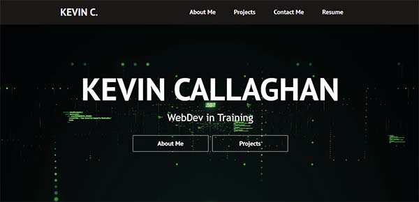
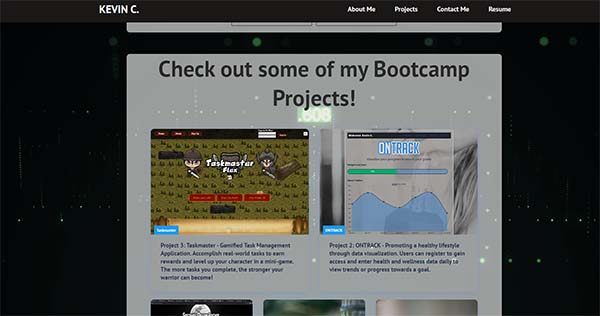

# Kevin-Callaghan-React-Portfolio

## Description

This portfolio created in React is intended to use as a way to display my bootcamp projects and provide a method of contact for prospective employers.  It contains links to the deployed projects, a contact-me form, and a link to download my resume.

## Table of Contents

- [Installation](#installation)
- [Usage](#usage)
- [Credits](#credits)
- [License](#license)

## Installation

There are no installation steps.  Simply follow the link to the deployed site (located in Usage) and take a look!

## Usage

Link to deployed site: https://kevincallaghan.github.io/Kevin-Callaghan-React-Portfolio/ 

Click the link to the deployed site and explore my portfolio.  Navigate the page either by using the links at the top, or by following the buttons in each section to scroll down the page.  Check out my "about me" for some background information, view my bootcamp projects, send me an email using the contact form, download a copy of my resume, or visit my github and linked in via the social icons in the footer!

Here is a screenshot of the homepage:

Here is a screenshot of the projects section:

    

## Credits

1. The home background video is royalty-free and has no license requirements as provided by pexels.com.  Here is a link to the video used: https://www.pexels.com/video/digital-presentation-of-data-and-information-3130284/ 

2. The youtube video "React Website Tutorial - Beginner React JS Project Fully Responsive" by Brian Design inspired some component and css for background video.  Here is a link to the video: https://www.youtube.com/watch?v=I2UBjN5ER4s&t=5244s 

3. The article 'Element size and scrolling' from javascript.info was used to learn about offset properties when calculating the desired scroll locations needed to scroll to a certain position with an onclick event.  Here is a link to the article: https://javascript.info/size-and-scroll 

4. The article 'Element: scrollTo() method' from developer.mozilla.org was used to figure out how to use the offset properties to navigate up and down our page.  Here is a link to the article: https://developer.mozilla.org/en-US/docs/Web/API/Element/scrollTo 

5. I used this video from PedroTech's YouTube Page called "How To Deploy A React App To Github Pages (Simple)" to figure out how to deploy to github pages: https://www.youtube.com/watch?v=Q9n2mLqXFpU 

6. I used this article on create-react-app.dev to solve my problem with broken image links after running the build and deploying to github pages: https://create-react-app.dev/docs/using-the-public-folder/ 

7. Email JS functionality is from the EmailJS Docs.  Here is a link: https://www.emailjs.com/docs/examples/reactjs/ 

8. I used the stack-overflow page titled "How do I get my gh-pages branch to update?" to learn how to update the github pages deployed site after it has already been deployed.  Here is a link to the page: https://stackoverflow.com/questions/52022197/how-do-i-get-my-gh-pages-branch-to-update 

## License

MIT License

For additional License information, please see the LICENSE file in the repository.